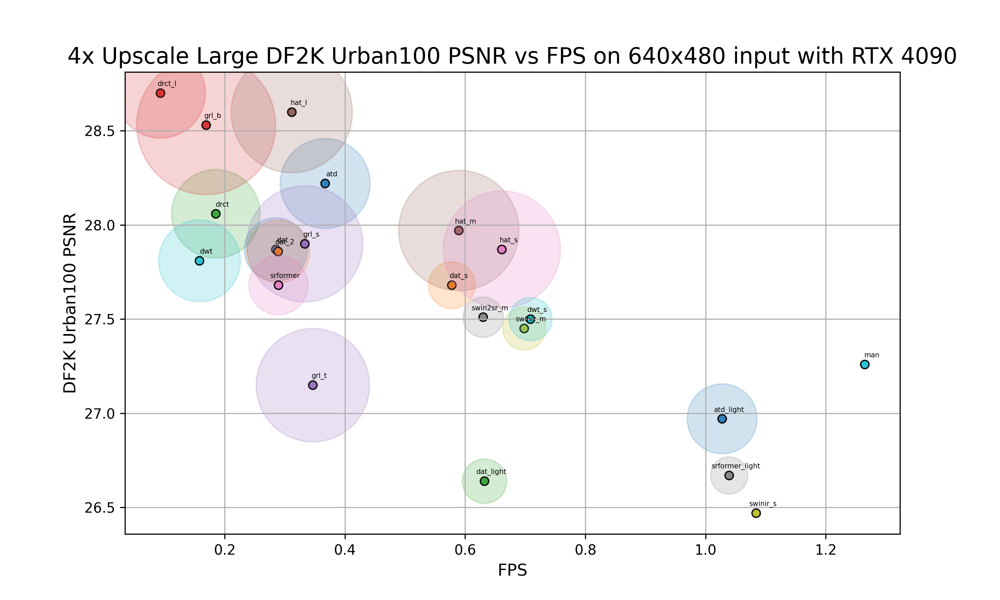
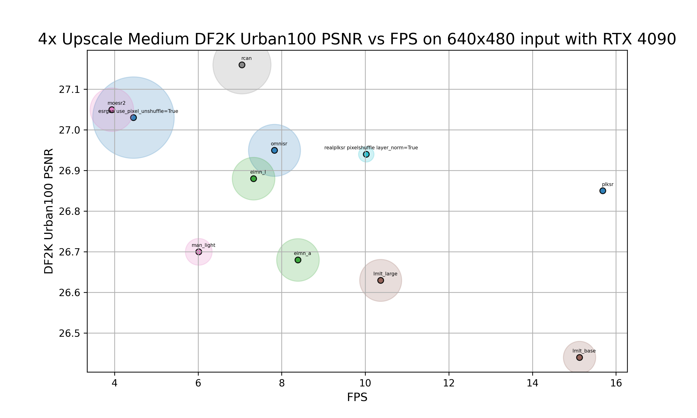
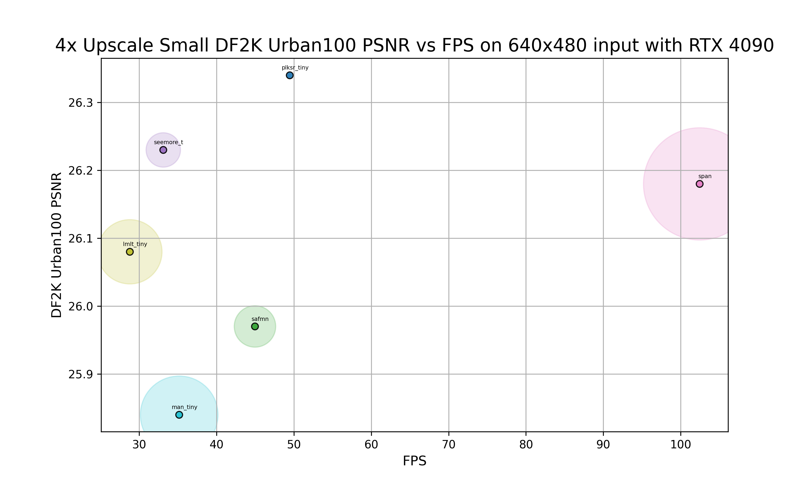
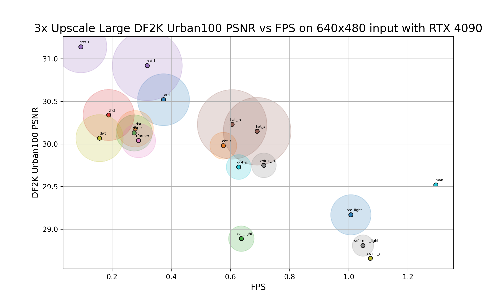
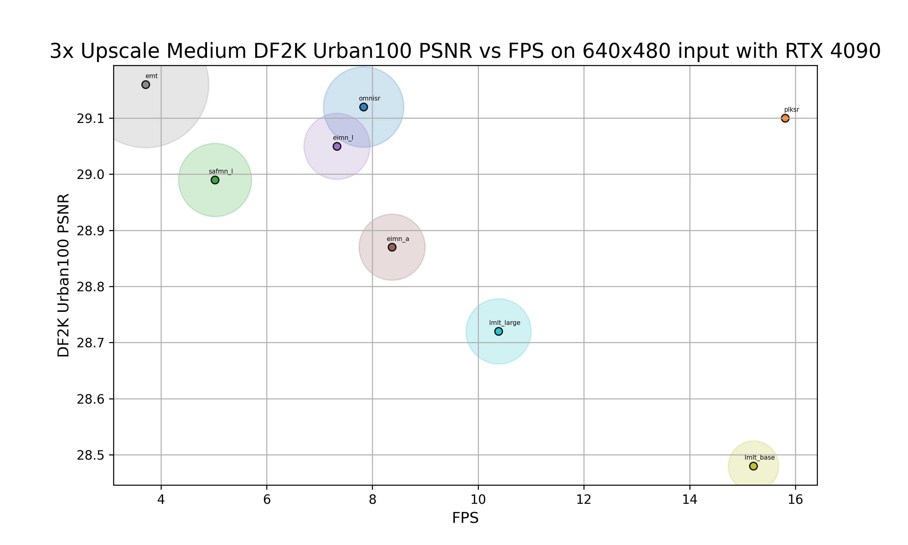
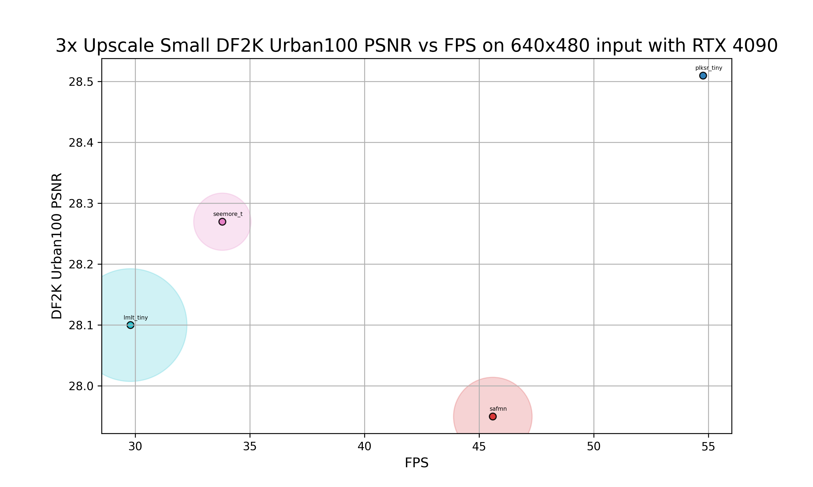
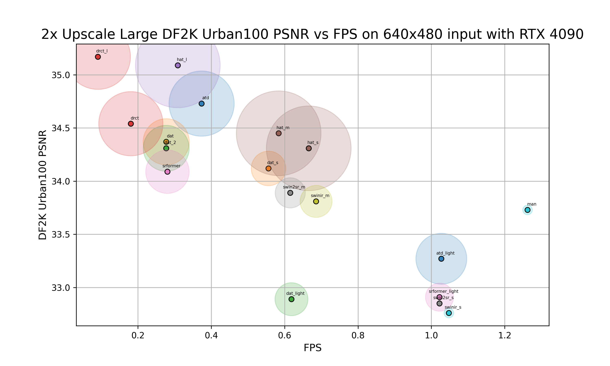
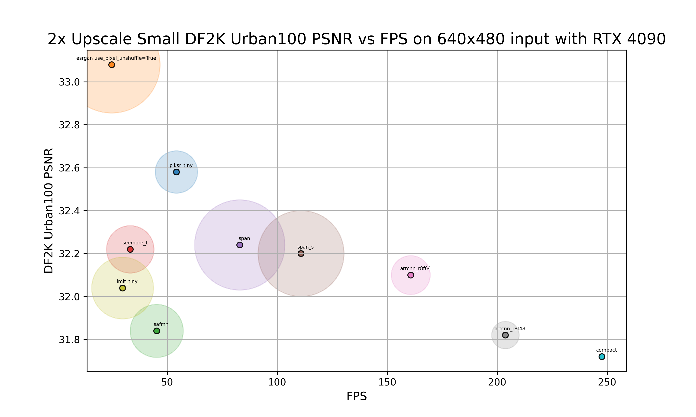

# Inference Speed vs VRAM vs PSNR Charts

All charts were generated using [generate_charts.py](https://github.com/the-database/traiNNer-redux/blob/master/scripts/benchmarking/generate_charts.py). For this benchmark data in tabular format please see the [Benchmarks](/benchmarks) page. An interactive tableau chart of this data is also available [here](https://public.tableau.com/app/profile/vaibhav.bhat1737/viz/shared/R9CDXNN7X), created by Enhance Everything Discord member SharekhaN.

Architectures are separated into groups based on their inference speed. The grouping is arbitrary and shouldn't be considered as any official categorization. The groups are currently defined as follows:
- Small: On 4x model, inference speed of 640x480 input on RTX 4090 is more than 24 fps.
- Medium: On 4x model, inference speed of 640x480 input on RTX 4090 is between 2 and 24 fps.
- Large: On 4x model, inference speed of 640x480 input on RTX 4090 is less than 2 fps.

Only architectures which have metrics with the training set DF2K and validation set Urban100 are shown.

VRAM is depicted by the size of the shaded circle behind each dot, larger means higher VRAM consumption.

## 4x
### 4x Large Architectures

### 4x Medium Architectures

### 4x Small Architectures

## 3x
### 3x Large Architectures

### 3x Medium Architectures

### 3x Small Architectures

## 2x
### 2x Large Architectures

### 2x Medium Architectures

### 2x Small Architectures

